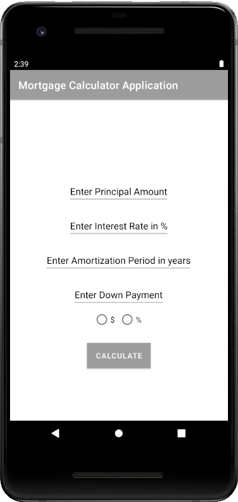

# Monthly Mortgage Calculator Application

**Student Name:** Tegveer Singh\
**Student ID:** 100730432

## Description
This is an Mortgage Calculator Application written for Assignment 1 Mobile Application Development.
The user can enter the principal, interest rate, amortization period and down payment.
The down payment can be entered as a percent value or as an amount.
The app will calculate the monthly payments required to pay the amount back

## Screenshots
Following screenshots have been taken from Google Pixel 2 Emulator Window

  
  
  
  

